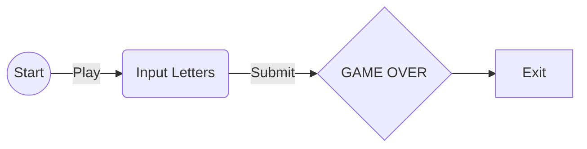

# Welcome to BOGGLEBOARD!

## Introduction
BoggleBoard is a Word Game played on a Grid of Lettered Dice, in which players attempt to find words in sequences of adjacent letters.

The game begins by shaking a covered tray of cubic dice, each with a different letter printed on each of its sides. The dice settle into a tray so that only the top letter of each cube is visible. After they have settled into the grid, a three-minute  Timer  is started and all players simultaneously begin the main phase of play.

Each player searches for words that can be constructed from the letters of sequentially adjacent cubes, where "adjacent" cubes are those horizontally, vertically, and diagonally neighboring. Words must be at least three letters long, may include singular and plural (or other derived forms) separately, but may not use the same letter cube more than once per word. Each player records all the words they find by writing on a private sheet of paper. After three minutes have elapsed, all players must immediately stop writing and the game enters the scoring phase.

## FlowChart
A pretty simple flow of this mini game.

